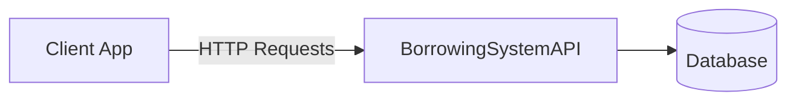

# 📚 Borrowing System Client Application

[](https://nextjs.org/)
[](https://tailwindcss.com/)
[](https://www.typescriptlang.org/)
[](https://opensource.org/licenses/MIT)


Modern frontend application for managing item borrowing workflows, integrated with [BorrowingSystemAPI](https://github.com/Gaitan19/BorrowingSystemAPI).

## 🌟 Features

- 🔐 JWT Authentication with role-based access
- 📦 Full inventory management system
- 📋 Request lifecycle management (Create/Approve/Return)
- 📊 Real-time dashboard analytics
- 🎨 Responsive UI with dark/light mode
- 📱 Mobile-first design
- 🛡️ Form validation & error handling
- 🔄 API synchronization with React Query
- 📈 Comprehensive audit logs

## 🚀 Quick Start

### Prerequisites

- Node.js v18+
- npm v9+ or yarn
- Running [BorrowingSystemAPI](https://github.com/Gaitan19/BorrowingSystemAPI)

### Installation

```bash
git clone https://github.com/Gaitan19/BorrowingSystem-ClientApp.git
cd BorrowingSystem-ClientApp
npm install
cp .env.example .env.local
npm run dev
```

## ⚙️ Configuration

Edit `.env.local`:

```env
NEXT_PUBLIC_API_URL=http://localhost:5000/api
NEXT_PUBLIC_JWT_SECRET=your_jwt_secret_here
NEXT_PUBLIC_DEFAULT_PAGE_SIZE=10
```

## 🛠️ Tech Stack

| Category          | Technologies                                                                 |
|-------------------|------------------------------------------------------------------------------|
| **Framework**     | Next.js 14                                                                   |
| **Language**      | TypeScript 5                                                                 |
| **Styling**       | Tailwind CSS, Heroicons                                                      |
| **State**         | React Query, Zustand                                                         |
| **Forms**         | React Hook Form                                                              |
| **UI**            | Headless UI, Radix UI                                                        |
| **Utilities**     | Axios, date-fns, clsx                                                        |

## 📚 API Integration

Integrated with [BorrowingSystemAPI](https://github.com/Gaitan19/BorrowingSystemAPI):



Key Endpoints:
- `POST /auth/login` - User authentication
- `GET /items` - Inventory management
- `POST /requests` - Create borrowing requests
- `PUT /requests/{id}` - Update request status


## 🏗️ Project Structure

```bash
src/
├── app/
│   ├── (auth)/          # Authentication routes
│   ├── dashboard/       # Protected routes
│   └── layout.tsx       # Root layout
├── components/          # Reusable components
├── contexts/            # React contexts
├── hooks/               # Custom hooks
├── services/            # API services
├── styles/              # Global styles
├── types/               # TypeScript types
└── utils/               # Utility functions
```

## 🤝 Contributing

1. Fork the repository
2. Create feature branch:
```bash
git checkout -b feature/awesome-feature
```
3. Commit changes:
```bash
git commit -m 'feat: Add awesome feature'
```
4. Push to branch:
```bash
git push origin feature/awesome-feature
```
5. Open a Pull Request

## 📄 License

Distributed under the MIT License. See [LICENSE](LICENSE) for details.

## 📬 Contact

**Kenley Gaitán**  
[](https://www.linkedin.com/in/kenley-gaitan-evanks-0a2739363/)  
[](https://github.com/Gaitan19)  
✉️ [kenleyjos1906@outlook.com](mailto:kenleyjos1906@outlook.com)

---

**Powered by:**  
[](https://nextjs.org/)
[](https://tailwindcss.com/)
[](https://www.typescriptlang.org/)
